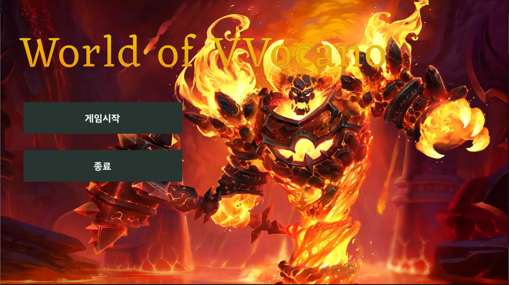
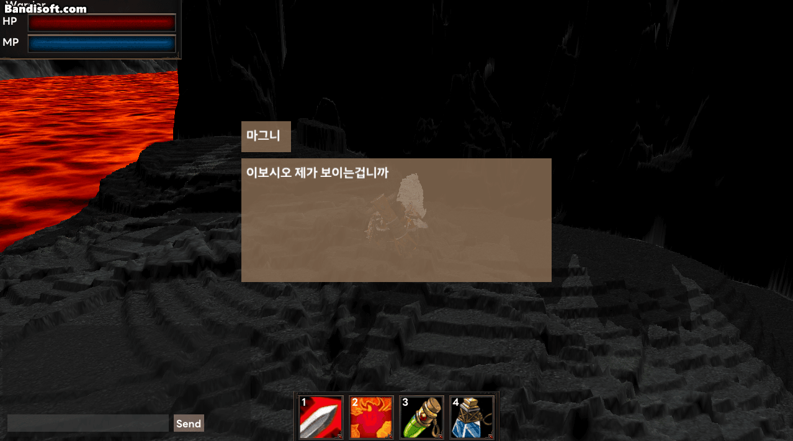

# Team Cheetah
  * DirectX Team Project KGCA 42 TeamCheetah
#  Description
 
  * 주인공(전사)를 조작하여 던전에 입장 한 후 중간보스(바론 남작)과 최종보스(라그나로스)를 물리치는 게임
  * 몬스터는 행동패턴이 존재하며 중간보스 이상급 몬스터는 특수한 기술을 사용한다
  * 멀티플레이 가능
# Environment
 * **Build Require OS** : Window10

 * **Build Require IDE** : VisualStudio 2022

# Members
 * Map, Effect : 김동현(Team leader)
 * Engine, Character : 박진원
 * Network, UI : 이송하
# Play
### 
로비

***
### 
던전

***
### 
중간보스

***
### 
최종보스

***
